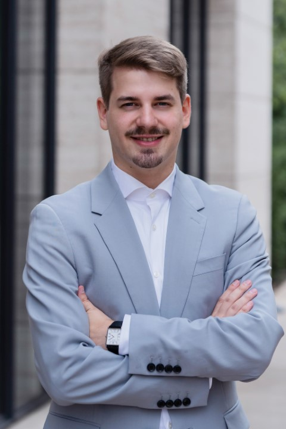

Hey, I am Christopher (26 years old) from Frankfurt (Germany) and I am an IT professional who is currently employed as a Cybersecurity-Consultant working in the german banking industry as SOC-Analyst to analyze SIEM-Alerts and help improving the SIEM-Infrastructur for the client.
Previously, I worked as an IT systemadministrator, IT support and IT project worker.  
This allowed me to gain technical experience with a wide range of IT systems.

I found strong interest in networks and cybersecurity in my role as systemadministrator and currently I am studying for certificates to soon be able to work in the field of networking & network security.

Currently pursuing the compTia Security+ certification with an anticipated passing date of end of July. 
Afterwards I want to finish the CCNA Certification (Cisco) in a time frame of 4 months which I started to learn for in the last months in my role as systemadministrator.  
I am passionate about IT in general and looking forward to connect with people and have conversations about our great field.

My published articles will have a focus on networking and cybersecurity but occasionally there could always be a general IT topic.

Feel free to keep in touch using your preferred social media – I have linked to all my social media accounts to the left!

Have a good read !  
Christopher  
 
