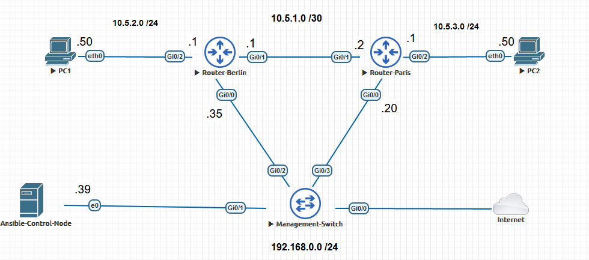
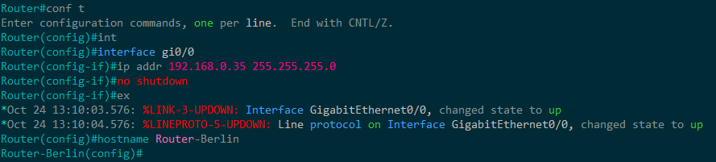
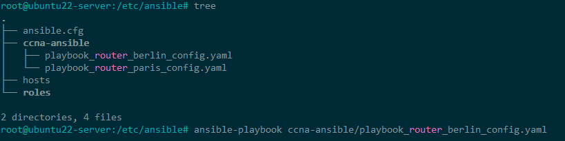
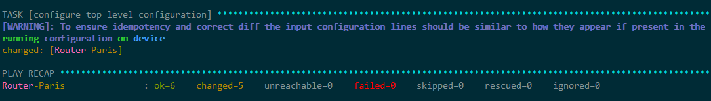
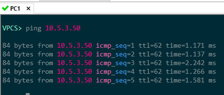
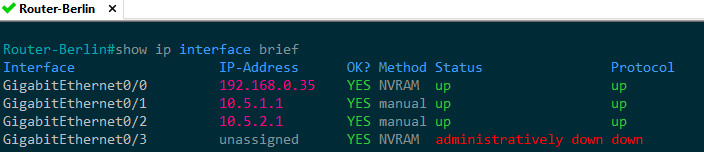
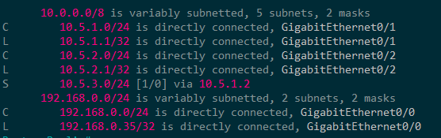

+++
author = "Christopher Vierheller"
title = "Automate your CCNA-Labs with Ansible"
date = "2022-11-03"
description = "Automating CCNA-Labs with Ansible in EVE-NG to start your Network-Automation-Journey "
categories = [
    "Networks",
    "EVE-NG",
    "CCNA"
]
tags = [
    "Ansible",
    "Network Automation",
    "EVE-NG"
]
image = "ansible_cover_1.png"
+++

Hello guys,

have you always wanted to start trying out network automation tools like Ansible?
Where do you start ? Today I will show you how to start with Ansible in a practical scenario to get your feet wet with this topic.
You can learn network automation while learning for your CCNA to make your own automated labs. This will gain you valuable knowledge for your future. You will need EVE-NG (open-source) for this tutorial. I will link you to sources where to go after the tutorial to gain more knowledge about Ansible since teaching the concepts of Ansible will exceed the frame of this blog post.

## Requirements

* installed and running version of EVE-NG in the same subnet as your homerouter
* basic network-knowledge and little experience with Cisco routers
* Cisco VIRL/CML Images (can only be purchased on the official Cisco Store)
* WinSCP or another SFTP-client

## Scenario / Goals

We want to reach the goal in this scenario to configure the other interfaces of the routers Berlin and Paris and adding a static route, so that PC1 and PC2 can reach and ping each other. We will create a Ansible-Server which will orchestrate and configure the routers after we connect and configure the GigabitEthernert 0/0 interfaces of the routers to our home-subnet.

  

## Setup Ubuntu Server and install Ansible

First you need to download this special EVE-NG Linux Ubuntu Image **[here](https://www.eve-ng.net/index.php/documentation/howtos/howto-create-own-linux-host-image/)** and follow the instructions on the website.

Now you will create a new EVE-NG Lab and will add a Linux-Ubuntu Server.
You need to add now the other devices from the network-topology too.
These are two cisco routers, one cisco switch, two virtual PC´s.
Finally you need to add a network and select **ManagementCloud** so that it is bridged to your home-router subnet for the Internet connection. Connect the devices like in my network-topology. The ubuntu-server will get automatically a IP from your DHCP-server.  
Start up all devices. We have to configure only the two routers on one interface and to allow ssh, so Ansible will get acces to the devices to push the configurations to it. Set here static IP-adresses out of your home-router´s DHCP address-space. 

We will configure now a initial config to each Cisco Router so we can push configs to them and configure automatically the remaining things.
You have to do this then for the Router-Paris too and configure the correct IP-address. 
The Gi0/0 interface will get a static IP, SSH will be enabled and the SSH-User **ansible** with password **ansible** will be created.

Initial Configuration for the Router-Berlin:
```diff
    Router-Berlin(config)#int Gi0/0
    Router-Berlin(config)#ip addr 192.168.0.35 255.255.255.0
    Router-Berlin(config)#no shutdown
    Router-Berlin#conf t
    Enter configuration commands, one per line.  End with CNTL/Z.
    Router-Berlin(config)#username ansible priv 15 secret cisco
    Router-Berlin(config)#ip domain-name automation.com
    Router-Berlin(config)#crypto key generate rsa 
    The name for the keys will be: Router-Berlin.automation.com
    Choose the size of the key modulus in the range of 360 to 4096 for your
    General Purpose Keys. Choosing a key modulus greater than 512 may take
    a few minutes.

    How many bits in the modulus [512]: 1024
    % Generating 1024 bit RSA keys, keys will be non-exportable...
    [OK] (elapsed time was 1 seconds)

    Router-Berlin(config)#
    *Oct 27 12:43:04.114: %SSH-5-ENABLED: SSH 1.99 has been enabled
    Router-Berlin(config)#ip ssh version 2
    Router-Berlin(config)#line vty 0 15
    Router-Berlin(config-line)#login local
    Router-Berlin(config-line)#transport input ssh
```
 

Now on the ubuntu-server I recommend you to do these following steps to update the system and to enable SSH.
After that you can use your favorite SSH-Program to access the server. 
```diff
    sudo apt-get update && apt-get upgrade
    sudo dpkg-reconfigure keyboard-configuration
    sudo systemctl enable ssh
    sudo systemctl start ssh
```
Default login credentials for this image: 
* User: **user** / Password **Test123**
* User: **root** / Password **Test123**

Now we will install Ansible with the following commands and verify the version at the end.
```diff
    $ sudo apt update
    $ sudo apt install software-properties-common
    $ sudo add-apt-repository --yes --update ppa:ansible/ansible
    $ sudo apt install ansible
    $ ansible --version
```
Add the Berlin and Paris router to the local host-file on the ubuntu system so the FQDN will get resolved immediately.
Add these two lines text into the host-file with the command **nano /etc/host**
```diff
    192.168.0.20 Router-Paris
    192.168.0.35 Router-Berlin
```

We will check now if we have a good and working network-connection with low latency to the Cisco-Routers. The results show we have a good connection between 1.5 and 2.5 ms.
```diff
    root@ubuntu22-server:/etc/ansible# ping Router-Berlin -c 5
    PING Router-Berlin (192.168.0.35) 56(84) bytes of data.
    64 bytes from Router-Berlin (192.168.0.35): icmp_seq=1 ttl=255 time=2.37 ms
    64 bytes from Router-Berlin (192.168.0.35): icmp_seq=2 ttl=255 time=2.25 ms
    64 bytes from Router-Berlin (192.168.0.35): icmp_seq=3 ttl=255 time=1.66 ms
    64 bytes from Router-Berlin (192.168.0.35): icmp_seq=4 ttl=255 time=2.33 ms
    64 bytes from Router-Berlin (192.168.0.35): icmp_seq=5 ttl=255 time=1.79 ms
```
The SSH-Connection will not work because of different encryption-algorithms which are supported on these different ssh-program of the devices. 
Add the following lines to the SSH-config (~/.ssh/config) on the Ubuntu-server to allow different encryption-algorithms. 
```diff
    root@ubuntu22-server:~# nano ~/.ssh/config
    add text
    Host 192.168.0.35
        KexAlgorithms +diffie-hellman-group-exchange-sha1
        HostkeyAlgorithms +ssh-rsa
    Host 192.168.0.20
        KexAlgorithms +diffie-hellman-group-exchange-sha1
        HostkeyAlgorithms +ssh-rsa
```

Confirm working SSH-access by connecting to the router. 
```diff
ssh ansible@192.168.0.35
```

## Uploading Ansible Files and Playbooks
 
 Download the [**ansible-networkautomation**](https://github.com/packetwarrior95/ansible-networkautomation) folder on my Github and upload it to your ubuntu-server to the path **/etc/ansible** (not the readme-file) with your favorite file-transfer program. I recommend WinSCP for this task.
 Here you can find playbooks and a **hosts**-file. In the playbook we define what we will configure and in the host-file we define which device we configure and what way/connection-type we use for it. If you used different IP-addresses than me, you have to edit the file **/etc/ansible/hosts** with your IP´s. 
 The file-structure should look like this when you are done.

  

 ## Executing Ansible playbooks for the automated configuration

 Finally we did all the preparation work.

 We can finally push the configuration to the two routers to reach our goal and without manually executing commands on the routers.

 If you want to execute an Ansible-Playbook to execute a change, you just need the command **ansible-playbooks** yaml-filename.
```diff    
    sudo ansible-playbooks /etc/ansible/ccna-ansible/router_berlin_configuration.yaml
``` 

You should now see something like this. Several changes were made.
Here in the overview after the playbook-execution you see if something failed, if something was even changed and how many changes were done.

 

Wuhuhuu!! We successfully configured automated the other router interfaces and added a static route to the routing table.

## Checking the results / Can I ping PC2 from PC 1 ?

In the final step we will confirm the Ansible configuration by connecting to the devices and checking the current configuration.

**Ping from PC1 to PC2**  
 

**Router-Berlin: Interface IP Configuration**
 

**Router-Berlin: IP Routingtable**
 

We can confirm that everything was successful configured.

## Where to get more information about Ansible

Now you can continue to learn about Ansible with these resources:

* [**Pluralsight-Course**](https://www.pluralsight.com/courses/ansible-network-automation-getting-started) by Christopher Hart (recommended)

* [**Official Ansible Documentation**](https://docs.ansible.com/ansible/latest/user_guide/index.html#getting-started)

* [**Cisco IOS Modules/Playbooks**](https://docs.ansible.com/ansible/latest/collections/cisco/ios/index.html)

* **Books: Mastering Python Networking by Eric Chou**


I hope you learnt something and my tutorial was useful : )

Reach out on my social-media accounts when you have any questions.

Thanks for reading,  
Christopher


<style>
.canon { background: white; width: 100%; height: auto; }
</style>

