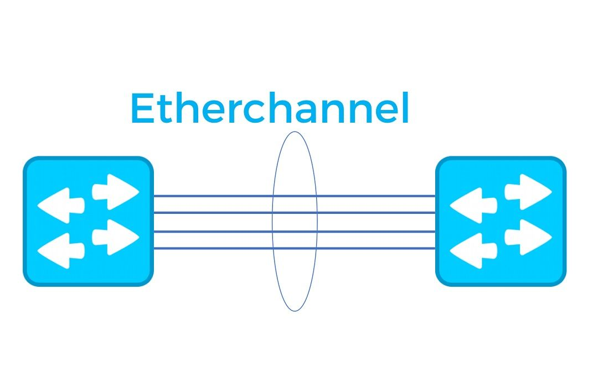

+++
author = "Christopher Vierheller"
title = "EtherChannel Explained: Overview and Configuration"
date = "2023-05-04"
description = "Technical overview about Etherchannel and how to configure it"
categories = [
    "Cisco",
	"CCNA",
    "Networks"
]
tags = [
    "EtherChannel"
]
image = "network.png"
+++

Hello people,

today I will explain you what EtherChannel exactly is and how you can configure it on your Cisco devices. 

## What is EtherChannel?

EtherChannel (also known as Link Aggregation or NIC Teaming) is a technology that enables the aggregation of multiple physical links into a single logical link. This is achieved by bundling together multiple Ethernet links and presenting them to the upper layer as a single high-bandwidth link.
EtherChannel can be used to increase network bandwidth, improve network redundancy, and load balance traffic.

EtherChannel technology was first introduced by Cisco Systems in the early 1990s, and it has since been widely adopted by other networking vendors. It is supported on various network devices including switches, routers, and servers.

There are two widely used EtherChannel-Protocols nowadays. Cisco proprietary EtherChannel protocol PAgP and LACP is defined in IEEE. 802.3ad. 


## How EtherChannel Works

EtherChannel works by bundling two or more Ethernet links together into a single logical link. This logical link appears to the upper layer as a single, high-bandwidth link. The physical links that make up the EtherChannel are called member links, and they must have the same speed and duplex settings.

There are two modes of EtherChannel: static and dynamic. In static mode, the network administrator manually configures the member links that will be bundled together into the EtherChannel. In dynamic mode, the network devices automatically negotiate the creation of the EtherChannel.

There are two protocols used for dynamic EtherChannel: Port Aggregation Protocol (**PAgP**) and Link Aggregation Control Protocol (**LACP**). PAgP is Cisco proprietary, while LACP is a standard protocol that is supported by multiple vendors. LACP is the recommended protocol to use for EtherChannel.

## Benefits of EtherChannel

EtherChannel provides several benefits for your network-connections:

*	**Increased bandwidth**: By bundling multiple physical links, EtherChannel can provide a higher bandwidth.
*	**Improved redundancy**: EtherChannel can provide redundancy in case of a link failure. If one member link fails, traffic is automatically redirected to the remaining links in the EtherChannel.
*	**Load balancing**: EtherChannel can distribute traffic across the member links, which helps to balance the load and prevent bottlenecks.
*	**Simplified management**: By bundling multiple physical links into a single logical link, network administrators can simplify the configuration and management of the network.

## EtherChannel Configuration

The first step in configuring EtherChannel before configuring the correct protocol is to configure the same interface settings for each member link. This includes setting the speed and duplex settings, as well as any other relevant interface settings. 

For example, to configure the interface settings for interfaces GigabitEthernet0/1-4 in order to create an **L2 Etherchannel Trunk** on a Cisco Switch, use the following commands:

```diff
    interface range GigabitEthernet0/1-4
    switchport trunk encapsulation dot1q
    switchport mode trunk
    switchport nonegotiate
    speed 1000
    duplex full
```

Now we can continue with the etherchannel-protocol configuration using LACP or PAgP to create an aggregated port-channel. You have to decide first, which protocol you want to use and configure both connection ends with the same protocol.

### LACP Configuration

**Step 1: Enable LACP**

Now you need to enable LACP on each member link. LACP can be enabled using the channel-group command. For example, to enable LACP on interfaces GigabitEthernet0/1-4 and add it to channel group 1, use the following command:

```diff
    interface range GigabitEthernet0/1-4
    channel-group 1 mode active
```

The "mode active" command specifies that the interface should actively negotiate with other LACP-enabled interfaces to form an EtherChannel. Do the "mode active" command on both connection ends.

Now a virtual Port-Channel 1 is created who acts as single link.

[Here is an overview](https://4.bp.blogspot.com/-wDwZtk44zLA/WSEXkqfoATI/AAAAAAAACwc/xVhjgZsQKawnjT2IcgIgFqkNhC7vPpWoQCLcB/s1600/pppp.png) how you can configure the channel-group modes in order to configure your desired protocol.

**Step 2: Verify LACP Configuration**

After configuring LACP on each member link, you should verify the configuration to ensure that LACP is working as expected. You can use the "show lacp neighbor" command to view information about the neighbor devices that are connected to each interface. For example, to view LACP information for interface GigabitEthernet0/1, use the following command:

```diff
    show lacp neighbor GigabitEthernet0/1
```

This command displays information such as the neighbor device ID, the neighbor port ID, the current LACP mode, and the LACP state.

**Step 3: Verify EtherChannel LACP Configuration**

After configuring the EtherChannel, you should verify the configuration to ensure that it is working as expected. You can use the "show etherchannel summary" command to view information about the EtherChannel configuration. For example, to view EtherChannel information for EtherChannel group 1, use the following command:

```diff
    show etherchannel summary | include Group 1
```

This command displays information such as the EtherChannel protocol, the number of member links, the operational status, and the load balancing method.

### PAgP Configuration

**Step 1: Enable PAgP**

Now you need to enable PAgP on each member link. PAgP can be enabled using the channel-group command. For example, to enable PAgP on interface GigabitEthernet0/1 and add it to channel group 1, use the following command:

```diff
    interface range GigabitEthernet0/1-4
    channel-group 1 mode desirable
```

The "mode desirable" command specifies that the interface should actively negotiate with other PAgP-enabled interfaces to form an EtherChannel.

Configure the "mode desirable" on both connection ends or look at the mode-chart from the previous configuration to enable a working PAgP Etherchannel

**Step 2: Verify PAgP Configuration**

After configuring PAgP on each member link, you should verify the configuration to ensure that PAgP is working as expected. You can use the "show PAgP neighbors" command to view information about the neighbor devices that are connected to each interface. For example, to view PAgP information for interface GigabitEthernet0/1, use the following command:

```diff
    show PAgP neighbors GigabitEthernet0/1
```

This command displays information such as the neighbor device ID, the neighbor port ID, the current PAgP mode, and the PAgP state.

**Step 3: Verify EtherChannel PAgP Configuration**

After configuring the EtherChannel PAgP, you should verify the configuration to ensure that it is working as expected. You can use the "show etherchannel summary" command to view information about the EtherChannel configuration. For example, to view EtherChannel information for EtherChannel group 1, use the following command:

```diff
    show etherchannel summary | include Group 1
```

This command displays information such as the EtherChannel protocol, the number of member links, the operational status, and the load balancing method.

I hope this article was valuable for you and helps in your IT-Journey.

Reach out on my social-media accounts when you have any questions.

Thanks for reading,  
Christopher


<style>
.canon { background: white; width: 100%; height: auto; }
</style>

