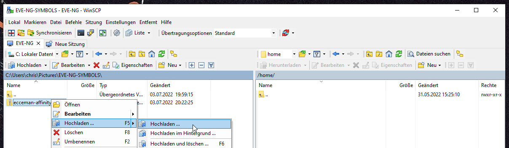
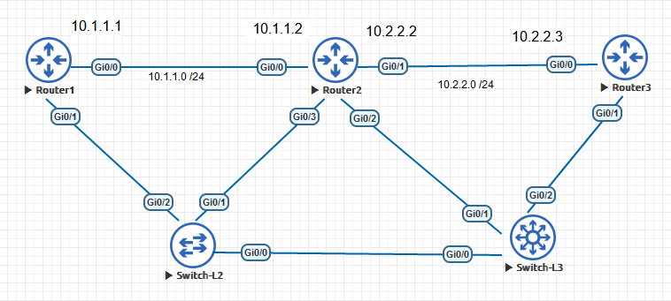
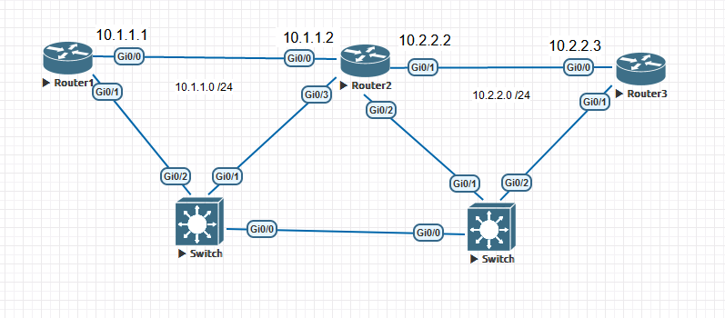

+++
author = "Christopher Vierheller"
title = "How to add custom symbols in EVE-NG"
date = "2022-07-02"
description = "Providing you with clear and beautiful blue network symbols for EVE-NG."
categories = [
    "Networks",
    "EVE-NG"
]
tags = [
    "EVE-NG"
]
image = "Next-Generation-Data-Centers-Everything-You-Need-to-Know.jpeg"
+++

Hello guys,

have you always wanted to replace the default symbols in EVE-NG and use your own ?
Today I will show you how to do this with little effort and even provide you with clear and beautiful blue network icons.  

## Requirements

* installed and functional version of EVE-NG in your preferred environment
* running SSH-Server on port 22
* WinSCP or another SFTP-client

## How to add your own symbols in EVE-NG

In the directory **/opt/unetlab/html/images/icons** are stored all the symbols you can select when adding a device in the lab in EVE-NG. Now you just need to have your own custom symbols in the png-format and in the size 52x52 pixels.  
Now just start your preferred SFTP-program, mine is [WinSCP](https://winscp.net/eng/download.php), and connect via SSH to the directory and upload your symbols.

## Adding provided blue network symbols

Fortunately [Affinity](https://github.com/ecceman/affinity) made beautiful and clear blue network symbols and [The NetworkBerg](https://github.com/TheNetworkBerg/ecceman-affinity-EVE-NG-Symbols) resized them in a finished png-format ready to use.  
  
Download the network symbols as zip-file from [The NetworkBergs Github](https://github.com/TheNetworkBerg/ecceman-affinity-EVE-NG-Symbols) and upload the zip-file to a random location in your EVE-NG machine via SFTP.  
  
  

Now unzip the file in the EVE-NG machine with the following command via SSH.  
```diff    
    unzip ecceman-affinity-EVE-NG-Symbols-master.zip
```
Now move all the png-files in the correct directory for the symbols and we are finished !  
```diff
    cd ecceman-affinity-EVE-NG-Symbols-master
    cd Eccman\ Affinity\ Blue\ Circle\ Symbols/
    mv * /opt/unetlab/html/images/icons 
```


## before vs after

Here you can take a look at an example with the new symbols in comparison to the standard-symbols in EVE-NG.  

  

  


I hope you have fun with the new symbols and my tutorial was useful : )

Reach out on my social-media accounts when you have any questions.

Thanks for reading,  
Christopher


<style>
.canon { background: white; width: 100%; height: auto; }
</style>

