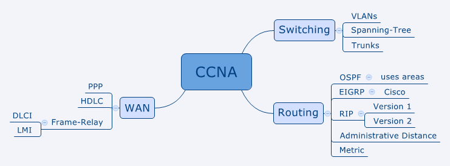

+++
author = "Christopher Vierheller"
title = "How Mindmaps help you study for your cerification (CCNA example)"
date = "2022-08-02"
description = "Mindmaps can provide a great overview of the demanded exam topics."
categories = [
    "CCNA",
    "General"
]
tags = [
    "CCNA",
    "Certifications"
]
image = "xmind1.png"
+++

Hello,

while studying for my CCNA certification I came across mindmaps and how they help you to study and get a feeling for the certifiation.

The following applies for all technical certifications. In my case I created a CCNA-mindmap.

## Why Mindmaps are useful when learning for your certification

Mindmaps give you a visual overview of the exam and the specific topics you need to know to pass the exam.  
  
Mindmapping is an active learning techniques where we retrieve information. Our brain does not store information as words, sentences or paragraphs. Instead, it keeps information as key points, diagrams and pictures. Mindmapping for studying is beneficial because mindmaps work similar to that of your brain. It makes information absorption easy.  

This **[article](https://moinulkarim.com/how-to-use-mind-maps-for-studying)** from Moniul goes more in-depth with reasearches and explanations how mindmaps help you to study. Check it out !

## X-Mind (free Mindmap-Software)

I recommend the free Mindmap-Software **[XMIND](https://xmind.net)**.

If you really love it you can buy the annual subscription (60$) for additional features.

* The software is easy to use
* You get quickly started and create your own mindmaps
* XMIND automatically adjust colors so they play well together
* Change the layout or the form of objectives on the fly
* Lots of Mindmap-Templates

## My CCNA-Mindmap (Download-Links included)

When I created the mindmap for the CCNA, I divided the topics into the five main domains network fundamentals, network access, IP connectivity, IP services, security fundamentals and automation. Then I created subnodes for every topic and subnodes of the subnodes when the topic goes deeper and many concepts also technical terms need to be known.

Download my CCNA-Mindmap on my **[Github Profile](https://github.com/packetwarrior95/mindmap-ccna)** as PDF, PNG or XMIND-File.  
  
You can edit the CCNA-mindmap with the xmind-file as you like when you download XMIND.

## Find Template-Mindmaps with mindmeister

**[Mindmeister](https://www.mindmeister.com)** is another online-tool for creating mindmaps.  
This website has a extensive public mindmap-database for certifications.

**Examples:**

* [CCNA](https://www.mindmeister.com/de/1869700889/ccna-200-301)
* [AWS Solution Architect Associate](https://www.mindmeister.com/de/544666576/aws-solution-architect-associates)
* [MS Azure Administrator](https://www.mindmeister.com/de/mind-map-examples?category=&language=&query=Azure+Administrator)
* [CompTia Security+](https://www.mindmeister.com/de/mind-map-examples?category=&language=&query=comptia+Security)

Another resource for Mindmap-Templates is [Biggerplate](https://www.biggerplate.com).

I recommend you to make your own mindmap but you can also download a finished mindmap to get inspired or to get a quick overview.

I hope this was useful for you and helps you in your learning-process to get your certification.

Reach out on my social-media accounts when you have any questions.

Thanks for reading,  
Christopher




